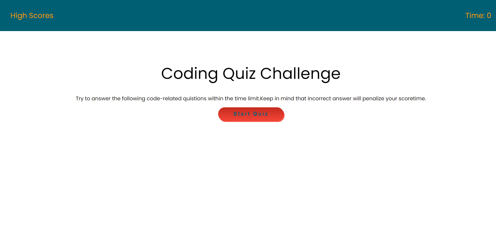
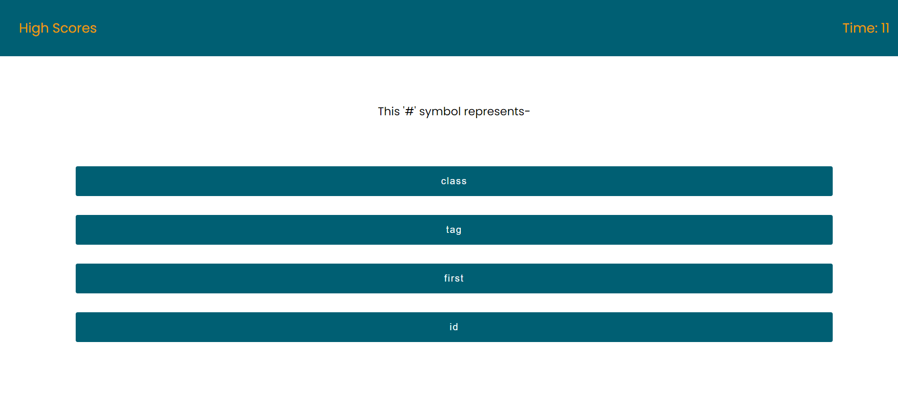
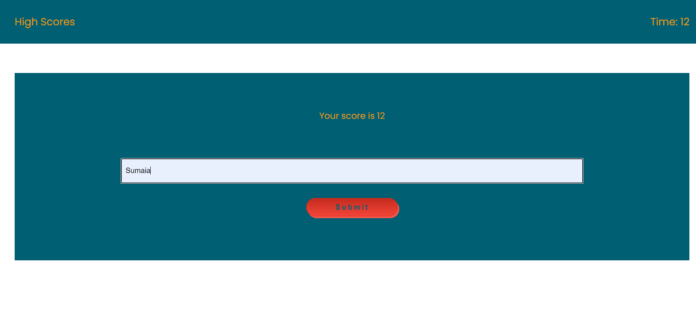
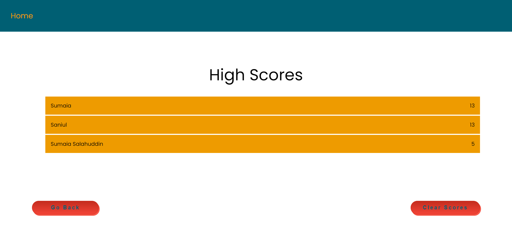
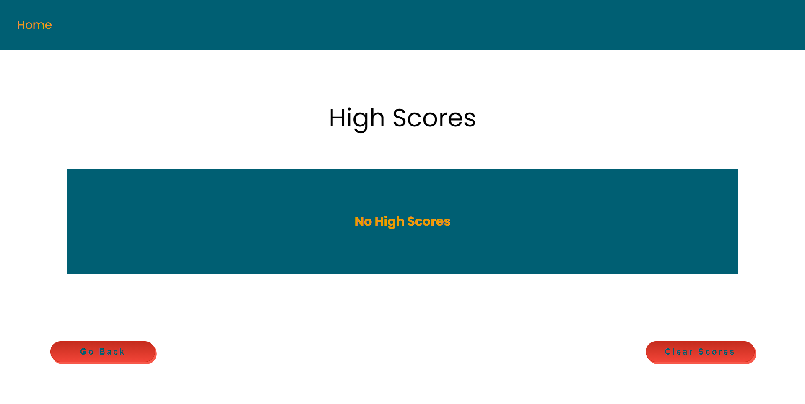

# code-quiz-js

Timed quiz on Javascript fundamentals that stores the high-scores.

## Description

As a user of this quiz challenge, when you navigate the home page, you will be presented with the questions with options. You need to start the first question and then you notice the timer will start counting down. For each correct, you will be awarded points, but for incorrect questions you will lose marks as well as some time will be taken off as penalty

## Technologies Used

Java script, CSS and Html were applied to develop this challenge. The main functionality is coming form the Java script which collected the response from the users, generate score, append and show results to the users. Users has also option to remove high score.

## Deployed URL

You can view the GitHub page deployed application [here](https://sumaiasorna.github.io/code-quiz-js/)

## Screenshots

#### Home

#### Question 1

#### Question 2

#### Question 3

#### Score page

#### Stored score

#### High score

